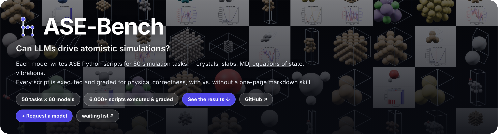
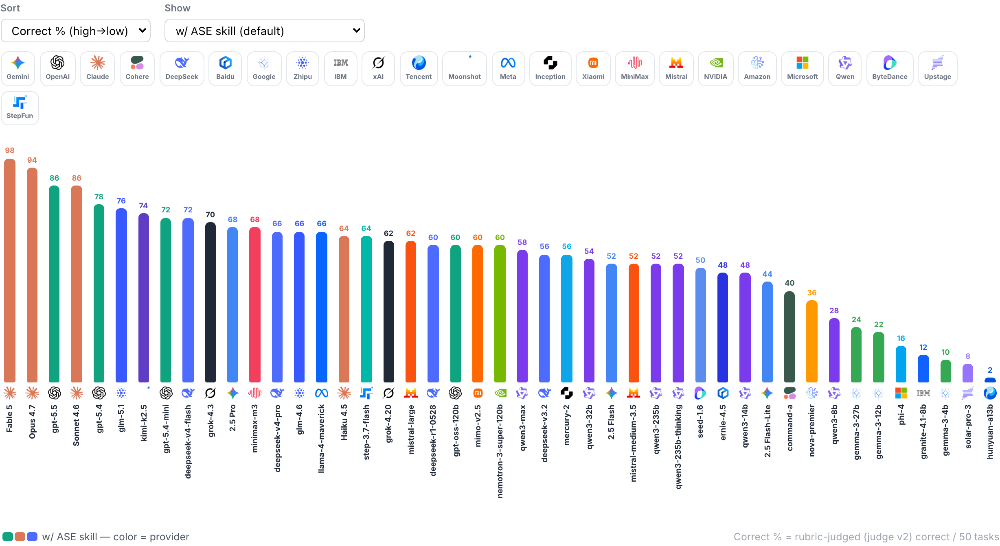
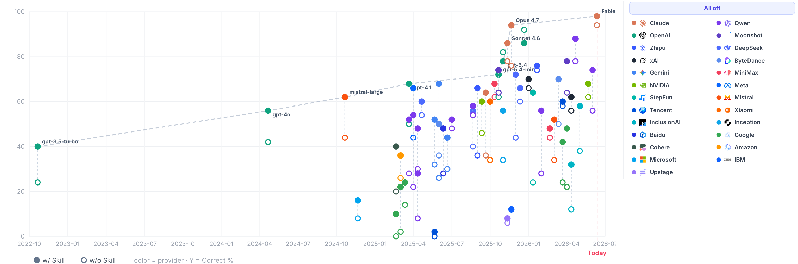

# ASE-Bench

[](https://asebench.schoung.com)

Can LLMs drive atomistic simulations? 60 models write ASE Python scripts for the 50 most common simulation tasks — executed and graded for physical correctness, with vs. without a one-page markdown skill.

**Live leaderboard:** [asebench.schoung.com](https://asebench.schoung.com) · [GitHub Pages mirror](https://s-choung.github.io/ase-bench/)





## How it works

1. **50 everyday ASE tasks.** The things people actually do with ASE day to day: building crystals, slabs and molecules, geometry optimization, MD (NVE/NVT/NPT), equations of state, vibrations, NEB, constraints, file I/O, databases (`prompts_50_eng.json`).
2. **One short instruction, two conditions.** Each model gets only a brief natural-language instruction per task and must write a runnable ASE Python script. Every model runs twice: as-is (*w/o skill*) and with a single one-page markdown ASE reference (`tasks/ase_skill_v3.md`) appended to the system prompt (*w/ skill*). That page is the entire intervention — no fine-tuning, no tools, no examples.
3. **Measurement 1 — does it run?** Every script is executed; **Runs%** = scripts that finish with `returncode == 0`.
4. **Measurement 2 — is it right?** Running code is often wrong (bad supercells, wrong counts, NaN cells). Every passing run is graded by a **rubric-based LLM judge (judge v2)**: per-task rubrics (`judge_rubrics_50.json`) with explicit 2/1/0 boundaries and reference values *computed with ASE/EMT in the benchmark's own environment* (`reference_facts.py`), cross-checked against deterministic structural anchors. A cross-model consistency audit (same task, same output → same verdict) shows **108 → 9** conflicting pairs versus a free-form judge. **Correct%** is the headline metric.

## Repository

| Path | What |
|---|---|
| `index.html` | the leaderboard (latest report) |
| `prompts_50_eng.json` / `prompts_50.json` | the 50 tasks (EN / KO) |
| `tasks/ase_skill_v3.md` | the skill — the entire intervention |
| `judge_rubrics_50.json` | per-task grading rubrics (judge v2) |
| `generated_v3/` | every generated script, per model × condition |
| `results_v3/judge_out_v2/` | verdicts + reasons (leaderboard source) |
| `scripts/` | runners, judge pipeline, report builders, visualizers |

## Add a model

Open a [model request](https://github.com/s-choung/ase-bench/issues/new?template=model-request.yml), or run it yourself:

```bash
python scripts/run_openrouter_50_eng.py <openrouter-alias>
```

## License

Code MIT · data & text CC-BY 4.0.
