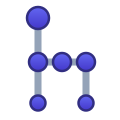
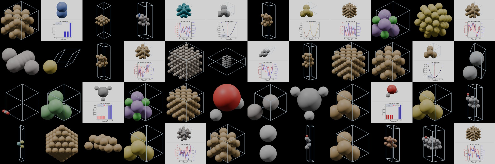

# ASE-Bench

**Can LLMs drive atomistic simulations?**

ASE-Bench asks each LLM to write [ASE (Atomic Simulation Environment)](https://wiki.fysik.dtu.dk/ase/) Python scripts for **50 atomistic-simulation tasks** — bulk crystals, surface slabs, molecular dynamics, equations of state, vibrational analysis — then **executes every script** and grades it for **physical correctness**, with and without a one-page markdown skill.

**Leaderboard / interactive report:** open `benchmark_report_v10.html` (serve locally: `python -m http.server 8765`, then visit `http://localhost:8765/benchmark_report_v10.html`).


*The backdrop: actual structures built by the models, rendered in Blender.*

## What makes it different

1. **runs → correct funnel.** `returncode == 0` only proves the code *runs*. Every passing run is additionally judged for correctness (right supercell, right atom counts, physically sane numbers). A large fraction of "passing" code is wrong — the Runs%–Correct% gap quantifies that inflation per model.
2. **LLM-judge, cross-checked.** Primary grading is Claude Opus-as-judge with a uniform rubric (2 correct / 1 partial / 0 wrong), validated against deterministic structural checks (atom counts, formulas, volumes, coordination numbers) with **97% agreement** on the overlapping set (`results_v3/correctness_audit.html`).
3. **A minimal intervention axis.** The *only* difference between the two conditions is appending one markdown page (`tasks/ase_skill_v3.md`, ~250 lines of API reference) to the system prompt. No fine-tuning, no tools, no answer examples. The headline finding: the skill's effect is an inverted U — mid-tier models gain enormously, frontier models are already near the ceiling.
4. **Everything is released.** All generated scripts (`generated_v3/`), execution records, judge verdicts with reasons (`results_v3/judge_out/`), deterministic checks, audits, Blender renders of the structures the models actually built, and the runners to reproduce or extend.

## Repository layout

```
benchmark_report_v10.html   # interactive leaderboard (heatmap, task explorer, visualizer, skill text)
prompts_50.json             # 50 tasks (Korean originals)
prompts_50_eng.json         # 50 tasks (English, used for the cross-vendor run)
tasks/ase_skill_v3.md       # the skill: the ENTIRE intervention
run_openrouter_50_eng.py    # runner: any OpenRouter model (resume-safe, retry, per-model JSON)
run_openai_50_eng.py        # runner: OpenAI direct API
run_claude_50.py            # runner: Anthropic direct API
run_gemini_50.py            # runner: Google direct API
generated_v3/               # every generated script, per model x condition
results_v3/                 # execution records, token usage
results_v3/judge_out/       # Opus-as-judge verdicts + one-line reasons, per model x condition
results_v3/correctness.json # deterministic structural checks (anchor)
correctness_check.py        # deterministic checker (re-runs from saved stdout, no API needed)
build_audit.py              # judge-vs-anchor agreement audit -> correctness_audit.html
build_v8.py / build_v9.py / build_v10.py   # report build chain (v8 data merge -> v9 correctness -> v10 page)
structure_extract.py, render_*.py, viz_*.py, composite_viz.py, crop_renders.py, make_hero.py
                            # task-visualizer pipeline (run code -> XYZ -> Blender render -> plots)
renders/                    # Blender renders of the structures (one per task)
structures/                 # extracted XYZ files
```

## Scoring

| Stage | Definition |
|---|---|
| **Runs** | script executes with `returncode == 0` within timeout |
| **Correct** | Opus-as-judge verdict = 2 under a uniform rubric, cross-checked by deterministic anchors |

## Reproduce / extend

```bash
# add any OpenRouter model: one line in MODELS of run_openrouter_50_eng.py, then
python run_openrouter_50_eng.py <alias>          # both conditions, resume-safe
# rebuild the report chain
python build_v8.py && python build_v9.py && python build_v10.py
```

Runners read API keys from the macOS keychain (`openrouter-api-key`, etc.) — adapt `get_api_key()` for your environment.

## Caveats

- Task prompts are now public; treat post-release model results with the usual contamination caution. A held-out refresh set is planned.
- Provider logos in `assets/logos/` are trademarks of their respective owners, used for identification only.

## License

MIT (code). Benchmark data (prompts, results, verdicts) released under CC-BY-4.0 — please cite.

## Citation

```bibtex
@misc{asebench2026,
  title  = {ASE-Bench: Can LLMs drive atomistic simulations?},
  author = {Choung, Seokhyun},
  year   = {2026},
  url    = {https://github.com/s-choung/ase-bench}
}
```
